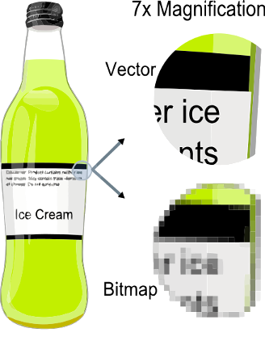
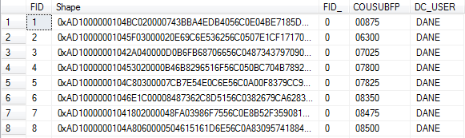
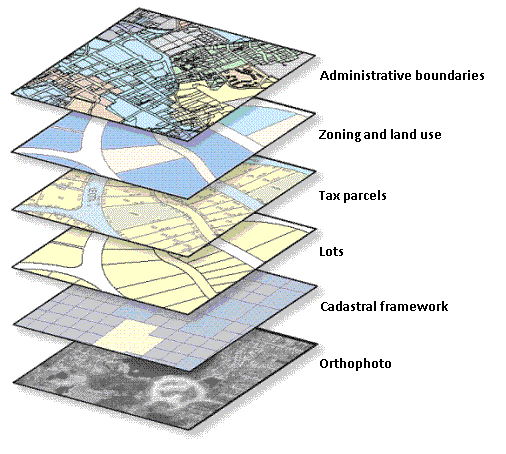
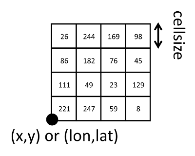

# GIS | Geographic Information Systems
<div class="notes">
GIS stands for Geographic Information Systems
</div>

## GIS | Geographic Information Systems

 - incorporating
 - storing
 - manipulating
 - analyzing
 - displaying...

<div class="notes">
and is the term used for the dicipline and practice of incorporating, storing, manipulating, maintaining, analyzing, and displaying spatial data. GIS can be conceptualized as a suite of tools for working with spatial data. 
</div>

# Spatial Data</font>

## What is <font color="red">spatial data?</font>

Nonspatial data **has no** location information

```{r}
nonspatial = data.frame(
  id=c(1,2,3,4),
  data=rnorm(4)
)
print(nonspatial)
```

## What is <font color="red">spatial data?</font>

Spatial data **has** location information

The simplest spatial data are points on a map

```{r}
spatial = data.frame(
  id=c(1,2,3,4),
  data=rnorm(4),
  x=runif(4,-180,180),
  y=runif(4,-90,90)
)
print(spatial)
```

## What is <font color="red">spatial data?</font>

Which we can convert to explicitly spatial data using the ```sp``` package. Most GIS packages in R store data as ```sp``` classes.

```{r results="hide", warning=FALSE}
library(sp)
```

## What is <font color="red">spatial data?</font> {.columns-2}

The ```sp``` package has a method called ```coordinates``` that converts points to an ```sp``` class.

```{r fig.show='hide'}
coordinates(spatial) = ~ x + y
class(spatial)
plot(spatial, axes=T)
```

<br>

```{r echo=FALSE, fig.width=4, fig.height=4}
plot(spatial, axes=T)
```

## What is <font color="red">spatial data?</font> {.smaller}

Spatial data also needs a **coordinate reference system** or **"projection"** that allows us to represent spatial features on a map. 

<div style="overflow-y: scroll; height: 400px;">

</div>

<div class="notes">
Projections can be thought of as simply a coordinate system with an origin that is relative to a known point in space.

This is a whole field of mathematically intensive study termed "geodesy"

</div>

## What is <font color="red">spatial data?</font> {.smaller}

All the coordinate reference system information you need is in the `rgdal` and `sp` packages, which use the PROJ.4 library for projections and transformations.

```{r results="hide", warning=FALSE, message=FALSE}
## will automatically load sp for us too
library(rgdal)
```
Wonderful document on CRS in R <a href="https://www.nceas.ucsb.edu/~frazier/RSpatialGuides/OverviewCoordinateReferenceSystems.pdf">here</a>

<div class="notes">
Note that we are playing fast and loose with our terminology here; terminology that would make an uptight geographer shriek. The idea is just to get us up and running and working well with these concepts.

Coordinate reference systems are ways of referencing X and Y (longitude and latitdue) to specific points on the Earth. When they don't match, identical points won't lay on top of one another.</div>

## What is <font color="red">spatial data?</font> {.smaller}

PROJ.4 (in `rgdal`) includes a comprehensive list of projections that are typically represented as a **string of parameters**. The simplest is a latitude/longitude system denoted as

```"+proj=longlat"```

To define the projection for ```spatial```, we write to its ```proj4string``` slot:

```{r}
proj4string(spatial) = "+proj=longlat"
```

Projections are a necessary evil for GIS users (to be continued)

<div class="notes">
where the coordinates are angular and the origin is the equator directly south of Greenwich, England. The simplest projection string to denote this projections is:
</div>

## What is <font color="red">spatial data?</font>

With a projection associated with our spatial data, we can now relate it to other spatial data. In other words, let's make a map!

```{r results="hide", warning=FALSE}
library(leaflet)
```

```{r eval=FALSE}
m = leaflet(data=spatial) %>%
  addTiles() %>%
  addMarkers()
m
```

<div class="notes">
Spatial data are data that are referenced to a location, that is the data have coordinates that pin it down to a location on the Earth. Examples are so myriad as to almost not be useful, e.g. restaurant location, streets, geologic strata, and precipitation, but they all have in common numeric values that reference the location of the data in X and Y (or longitude and latitude). EXPLANATION OF X AND Y.
</div>

## What is <font color="red">spatial data?</font>

```{r echo=FALSE, fig.width=8, fig.height=4}
m = leaflet(data=spatial) %>%
  addTiles() %>%
  addMarkers()
m
```

<div class="notes">
Arguably, the most common use of spatial data, and therefore GIS, are in data exploration, simply taking a look at where the phenomenon occur. This is useful in the sense that we can see obvious trends in the data, giving clues for further analysis, or merely checking our work, seeing if we have made mistakes. Additionally, spatial data is used for different kinds of analysis, leveraging the location data to make inferences. This analysis could take the form of selecting all wells that fall within certain soil types or in the construction of error terms in construction a statistical model.

Maybe delete this paragraph...
The most common software used in GIS are ArcGIS, produced by ESRI and QGIS, an open source analog, but there are many other software packages for GIS, both propietary and open-source. Any familiarity with the most popular GISs will show you that they are GUI-based and therefore much different from the look and feel of R, and, while R is not necessarily a replacement for the ArcGIS or QGIS, the analysis and plotting capability of R makes it a powerful GIS, and when it comes to model construction, R, and no suprise here, blows the common GIS platforms out of the water.
</div>

# Spatial data types

## Spatial data types | Two main types: vector and raster {.columns-2}

Vector = Polygons<br>
Raster = Grid<br><br>
Vector = Discrete<br>
Raster = Continuous<br><br>
Vector = Illustrator/Inkscape<br>
Raster = Photoshop/GIMP<br>

<br><br><br><br><br><br>



<div class="notes">
Maybe break this apart and put this into the respective intros of the datatypes below?
Spatial data are divided up into two kinds of data, vector data and raster data. Vector data consist of the location data being defined by points. There are three main kinds of vector data: points, lines and polygons. Point data, as might be guessed, are data where each observation is defined by one coordinate pair, X and Y. In line data each observation is defined by a series of coordinate pairs that define a one dimensional path in space. Polygons are data where each observation is defined by coordinate pairs that trace out a two-dimensional area. Common uses of vector data are for phenomenon that have discrete boundaries and locations, e.g., wells and bird sitings for points, rivers and streets (at certain scales) for lines, and county borders and soil types for polygon data. Raster data are constructed as grids that are laid out over an area. Each cell of the grid contains some information about the phenomenon, but each cell will not be explicitly given a coordinate pair, rather every cell has the same length and width and so only the certain corners of the data need to be given coordinate pairs. Precipitation and temperature data are often portrayed as raster data because of the way they vary continuously over the space. Examples of the creation, input, and output of these data types are given below.

Note to power users:
The usual definitions of these data describe vector data as being for data with discrete boundaries and raster data for that which continuously varies. While this is true in general, it is essentially a matter of convenience that determines which type is best. For example, you could represent a dataset of bird sitings in a raster format, but because the grid is so sparse (NA or 'no siting' for nearly all the cells) it saves memory (and makes more inuitive sense) to store the data as points. Conversely, rainfall data can be stored as thousands of points, each marking the estimated rainfall at that location, but storing the data in this format is rather cumbersome if the area is large. 

This presentation is meant to give an introduction to handling spatial data in R. It's intended audience are those with at least a basic knowledge of R and an interest in, though not necessarily knowledge of, working with spatial data. We will cover basic handling and manipulation of vector data and raster data, and then give a flyover of how coordinate reference systems work and how to work with them in R.
</div>

## Spatial data types {.smaller}

```{r echo=F, results="hide", warning=FALSE, message=FALSE, fig.width=7, fig.height=5}
library(rgeos)
par(mfrow=c(2,3), mar=c(2,2,3,1))
mcex = 0.7
## Spatial Points
sptl = data.frame(
    id=c(1,2,3,4),
    data=rnorm(4),
    x=runif(4,0,2),
    y=runif(4,0,2)
)
coordinates(sptl) <- ~ x+y
plot(sptl, axes=T, pch=19, main="Points")
mtext("bird sightings or fire hydrants", cex=mcex)

###Spatial Lines
l1 = cbind(c(1,2,3),c(3,2,2))
l1a = cbind(l1[,1]+1,l1[,2]+1)
l2 = cbind(c(1,2,3),c(1,1.5,1))
Sl1 = Line(l1)
Sl1a = Line(l1a)
Sl2 = Line(l2)
S1 = Lines(list(Sl1, Sl1a), ID="a")
S2 = Lines(list(Sl2), ID="b")
sl = SpatialLines(list(S1))#,S2
plot(sl, axes=T, main="Lines")
mtext("rivers or roads", cex=mcex)

## Spatial Polygons
x = readWKT("POLYGON((1 0,0 1,1 2,2 1,1 0))")
plot(x, axes=T, main="Polygons")
mtext("building footprint or county", cex=mcex)

## fourth plot
plot(1, type="n", axes=F, xlab="", ylab="")

## Raster
data("meuse.grid")
coordinates(meuse.grid) <- ~ x+y
gridded(meuse.grid) = TRUE
image(meuse.grid["dist"], main="Raster", axes=T)
mtext("distance to river or lead concentration", cex=mcex)

## sixth plot
plot(1, type="n", axes=F, xlab="", ylab="")
```

<div class="notes">
Vector data are commonly used for representing discrete phenomenon while rasters are for representing phenomenon that vary continuously over space, things that are suited to being represented by a surface.
</div>

# Vector Data

<div class="notes">
The backbone of R's vector data utilities can be found in the packages 'sp', 'rgeos', and rgdal, with a lot of helpful tools being found in classInt, maptools, and many others. This presentation explore R's functionality with vector data, we will examine two different datasets: a set of wards with census data and election results, and polygons of soil types. (See the workspace directory for how these were put together.)
</div>

## Vector data intro {.smaller}

```{r echo=F, results="hide", warning=FALSE, message=FALSE, fig.width=8, fig.height=4}
library(rgeos)
par(mfrow=c(1,3))#, mar=c(2,2,3,1)
mcex = 1
cexMain = 1.2
## Spatial Points
sptl = data.frame(
    id=c(1,2,3,4),
    data=rnorm(4),
    x=runif(4,0,2),
    y=runif(4,0,2)
)
coordinates(sptl) <- ~ x+y
plot(sptl, axes=T, pch=19, main="Points",cex.main=cexMain)
mtext("bird sightings or fire hydrants", cex=mcex)

###Spatial Lines
l1 = cbind(c(1,2,3),c(3,2,2))
l1a = cbind(l1[,1]+1,l1[,2]+1)
l2 = cbind(c(1,2,3),c(1,1.5,1))
Sl1 = Line(l1)
Sl1a = Line(l1a)
Sl2 = Line(l2)
S1 = Lines(list(Sl1, Sl1a), ID="a")
S2 = Lines(list(Sl2), ID="b")
sl = SpatialLines(list(S1))#,S2
plot(sl, axes=T, main="Lines",cex.main=cexMain)
mtext("rivers or roads", cex=mcex)

## Spatial Polygons
x = readWKT("POLYGON((1 0,0 1,1 2,2 1,1 0))")
plot(x, axes=T, main="Polygons",cex.main=cexMain)
mtext("building footprint or county", cex=mcex)

```

## Vector data intro

Whether, points, lines or polygons, *comprised of coordinate pairs*

```{r echo=F}
par(bg=NA)
#, results="hide", warning=FALSE, message=FALSE, fig.width=8, fig.height=4
ptsl2 = as.data.frame(l2)
names(ptsl2) = c("x","y")
coordinates(ptsl2) = ~ x + y
crdTxt = apply(l2, 1, FUN=function(x) paste(x[1], x[2], sep=", "))
plot(ptsl2, pch=19,cex=2)
text(x=l2[1:3], y=l2[4:6], labels=crdTxt, pos=3, cex=2, offset=1)
```

<div class="notes">
All of vector data is comprised of coordinate pairs.
Points are the simplest, merely coordinate pairs.
</div>


## Vector data intro
Whether, points, lines or polygons, *comprised of coordinate pairs*

```{r echo=F}
par(bg=NA)
#, results="hide", warning=FALSE, message=FALSE, fig.width=8, fig.height=4
sl2 = SpatialLines(list(S2))
crdTxt = apply(l2, 1, FUN=function(x) paste(x[1], x[2], sep=", "))
plot(sl2,lwd=2)
points(x=l2[1:3], y=l2[4:6],pch=19,cex=2)
text(x=l2[1:3], y=l2[4:6], labels=crdTxt, pos=3, cex=2, offset=1)
```

<div class="notes">
Lines are coordinate pairs but ordered, so it is understood that the line will connect the points in a certain order.
Polygons, also ordered pairs, but returns to the starting point and fills the space in between.
There are more complicated geometry but those will not be considered here
</div>


## Vector data intro
Whether, points, lines or polygons, *comprised of coordinate pairs*

```{r echo=F}
par(bg=NA)

ptsl2 = as.data.frame(l2)
names(ptsl2) = c("x","y")
coordinates(ptsl2) = ~ x + y

plot(ptsl2, pch=19,cex=2)
arrows(l2[1:2], l2[4:5], l2[2:3], l2[5:6], lwd=2)

# crdTxt = apply(l2, 1, FUN=function(x) paste(x[1], x[2], sep=", "))
text(x=l2[1:3], y=l2[4:6], labels=crdTxt, pos=3, cex=2, offset=1)
```

<div class="notes">
Lines are coordinate pairs but ordered, so it is understood that the line will connect the points in a certain order.
Polygons, also ordered pairs, but returns to the starting point and fills the space in between.
There are more complicated geometry but those will not be considered here
</div>

## Vector data intro
Whether, points, lines or polygons, *comprised of coordinate pairs*

```{r echo=F}
##Polygons
par(bg=NA)

ptsl2 = as.data.frame(l2)
names(ptsl2) = c("x","y")
coordinates(ptsl2) = ~ x + y

plot(ptsl2, pch=19,cex=2)
segments(l2[1:3], l2[4:6], l2[c(2,3,1)], l2[c(5,6, 4)], lwd=2)

# crdTxt = apply(l2, 1, FUN=function(x) paste(x[1], x[2], sep=", "))
text(x=l2[1:3], y=l2[4:6], labels=crdTxt, pos=3, cex=2, offset=1)
```

<div class="notes">
Polygons, also ordered pairs, but returns to the starting point and fills the space in between.
There are more complicated geometry but those will not be considered here
</div>

## Vector data intro
Whether, points, lines or polygons, *comprised of coordinate pairs*

```{r echo=F}
##Polygons
par(bg=NA)

ptsl2 = as.data.frame(l2)
names(ptsl2) = c("x","y")
coordinates(ptsl2) = ~ x + y

plot(ptsl2, pch=19,cex=2)
arrows(l2[1:3], l2[4:6], l2[c(2,3,1)], l2[c(5,6, 4)], lwd=2)

# crdTxt = apply(l2, 1, FUN=function(x) paste(x[1], x[2], sep=", "))
text(x=l2[1:3], y=l2[4:6], labels=crdTxt, pos=3, cex=2, offset=1)
```

<div class="notes">
Polygons, also ordered pairs, but returns to the starting point and fills the space in between.
There are more complicated geometry but those will not be considered here
</div>

## Vector data intro {.smaller}

Some vocab: each row (observation) is referred to as a _feature_.



The other data is often referred to as the _attribute table_ or as _attribute data_.

Each row is one observation (one feature), this becomes important later, as we'll need to refer to individual features or to the entire geometry.

<div class="notes">
Geometry is just another field in the table
</div>

## Vector data basics {.smaller}
Data Input/Output

```{r}
library(rgdal)
soils = readOGR(
    dsn="data",
    layer="soilsData")
```
```{r eval=FALSE}
writeOGR(
    soils,
    "data",
    "soilsData_out",
    driver="ESRI Shapefile"
)
```
<div class="notes">
 To read in the data we'll use the rgdal package (which is the R implentation of the GDAL suite of tools). Our data is in the form of shapefiles, but that doesn't concern us here (a shapefile is comprise of several different files, so we leave off the extensions) and we just tell 'readOGR()' where our data is and what the name of the file is. We'll also show a plot of what we're working with as well as miscellaneous functions to help us tell us what we're working with.
 
 You can see that as we read it in, R tells us how many features, how many soil polygons, are in the data we just read in and how many fields are in the attribute table. Shapefiles are the most common non-database format for spatial data, but later we will cover working with a table of points.
</div>

## Vector data basics {.smaller}

Other ways of creating of spatial data from list of coordinates: 
```{r}
wells = read.delim("./data/WellLocations.tsv")
class(wells); head(wells)
coordinates(wells) <- ~ x + y
class(wells)
```
<div class="notes">
Create a point layer from a flat file of coordinates
</div>

## Vector data basics {.smaller}

```{r}
slotNames(soils)
length(soils)
```
<div class="notes">
There a number of functions that are incredibly useful for understanding what sort of data you are working with
</div>

## Vector data basics {.smaller}
Accessing attribute data
```{r}
str(soils@data[,1:10])
```
<div class="notes">
attribute data is stored in the data slot, using shape@data
</div>

## Vector data basics {.smaller}
The geometry stored in the polygons slot
```{r}
str(soils@polygons[1])
```
<div class="notes">
Take a look at the structure of the shape itself
*You probably don't want to call ```head()``` or ```str()``` on a large spatial object, as this spits out the first six features and all their attributes
</div>

## Vector data basics {.smaller}

```{r messages=F}

silty = subset(soils, Silt1 > 70)
paste("There are", length(soils), "soil features total;")
paste(length(silty), "with a silt percentage over 70")
library(rgeos)
paste("Covering: ", round(gArea(silty)*0.000001,2), "Km2")
```
<div class="notes"> 
Grabbing soils above a certain level of silt
</div>

## Vector data basics
Making simple maps is quite easy

```{r eval=F}
par(mfrow=c(1,2), bg=NA)
plot(
    soils,
    main="Soils Polygons",
    col=rainbow(5))
plot(
    wells,
    main="Well Data",
    col='red'
)
```

## Vector data basics

```{r echo=F, fig.width=8, fig.height=6}
par(mfrow=c(1,2), bg=NA)
plot(
    soils,
    main="Soil Polygons",
    col=rainbow(5))
plot(
    wells,
    main="Well Data",
    col='red'
)
```

## Coordinate reference systems | A (very) brief break {.smaller}

A coordinate reference system (CRS) defines the surface of the world. 
If they don't match, errors and issues can arise


<div class="notes">
Very often we'll have questions that involve two different sets of spatial data, what are often referred to as layers. 
When working with two different layers it is important that they have the same cooridnate reference system. If they don't then they won't line up properly. To give the sense of what this is like for geographers, think of working with mixed measurements in feet and meters and not doing anything to correct them.
</div>

## Coordinate reference systems | A (very) brief break {.columns-2 .smaller}
To illustrate issues, where are the wells in relation to the soil?

```{r eval=FALSE}
soils = readOGR(
    dsn="data",
    layer="soilsData")
plot(
    soils,
    main="Soils"
)
plot(
    wells,
    add=T,
    cex=2,
    col='red',
    pch=19
)
```
<br><br><br><br><br><br><br><br><br><br><br>

```{r echo=F, fig.width=4, fig.height=5}
par(bg=NA)
plot(
    soils,
    main="Soils"
)
plot(
    wells,
    add=T
)
```
<div class="notes">
Okay, so what's going on here? 
</div> 

## Coordinate reference systems | A (very) brief break {.columns-2 .smaller}

```{r}
print(wells@proj4string)
print(soils@proj4string)

coordinates(wells)[c(1,16)]
coordinates(soils)[c(1,72)]

```
<div class="notes">
    Errors like this, and I still make them are how I learned about coordinate reference systems, so we'll take a brief little diversion here to explain how to deal with this. Notice here how there is no information associated with the points but there is with the soils. Also just note how the coordinates look (and its not always so easy to tell) but you can see that we have different units! 
</div>

## Coordinate reference systems | A (very) brief break {.columns-2 .smaller}
Solution: _define_ the CRS then _project_ the points to CRS of the soils data
```{r eval=FALSE}
wells@proj4string = CRS(
"+proj=longlat +ellps=WGS84 +datum=WGS84 +no_defs")
wells = spTransform(
    wells,
    soils@proj4string)
plot(soils)
plot(
    wells,
    add=T,
    cex=2,
    col='red',
    pch=19
)
```
<br><br>
```{r echo=F, fig.width=4, fig.height=5}
par(bg=NA)

wells@proj4string = CRS(
    "+proj=longlat +ellps=WGS84 +datum=WGS84 +no_defs")
wells = spTransform(
    wells,
    soils@proj4string)
plot(
    soils
)
plot(
    wells,
    add=T,
    cex=2,
    col='red',
    pch=19
)
```
<div class="notes">
By defining here we mean assign the well data some sort of CRS. It just came from a tab delimited file of coordinates so it doesn't know what those numbers mean. We assign it a CRS so it knows how to project it or transform those points to the same projection as the soils data.

Note that we are using what is known as the proj4 standard of specifying the crs. see spatialreference.org for any and all projections
</div> 

## Vector data {.smaller}

Another kind of relationship functions return the geometry
How do we get the overlapping area? 

```{r echo=F, warning=F, fig.width=6, fig.height=5}
par(bg=NA)
library(scales)
x = readWKT("POLYGON((1 0,0 1,1 2,2 1,1 0))")
y = readWKT("POLYGON((2 0,1 1,2 2,3 1,2 0))")

xy.union = gUnion(x,y)
bbox = gBuffer(gEnvelope(xy.union),width=0.5,joinStyle='mitre',mitreLimit=3)
par(mar=c(0.5,0.5,0.5,0.5))
plot(bbox, border='white')
plot(x, add=T, col=alpha('red', 0.5))
plot(y, add=T, col=alpha('blue', 0.5))
```
<div class="notes">
Arguably this is more common
</div>

## Vector data {.smaller}
We use the `gIntersection` function from `rgeos`.
The code `xyinter = gIntersection(x, y)` returns the intersecting area to us. Other functions like `gDifference`, or `gUnion`, also return geometry.

```{r echo=F, warning=F, fig.width=6, fig.height=5}
par(bg=NA)
library(scales)
x = readWKT("POLYGON((1 0,0 1,1 2,2 1,1 0))")
y = readWKT("POLYGON((2 0,1 1,2 2,3 1,2 0))")

xy.union = gUnion(x,y)
bbox = gBuffer(gEnvelope(xy.union),width=0.5,joinStyle='mitre',mitreLimit=3)
xy.inter = gIntersection(x,y)

par(mar=c(0.5,0.5,0.5,0.5))
plot(bbox, border='white')
plot(x, add=T, col=alpha('red', 0.15))
plot(y, add=T, col=alpha('blue', 0.15))
plot(xy.inter, add=T, col='purple')

```
<div class="notes">
Here you can see that purple bit is highlighting what's been returned from gIntersection.
</div>

## Vector data {.columns-2 .smaller}

Grab soils within a certain range of the middle of study area
```{r tidy=T, eval=F}
cent = gCentroid(soils)
bff = gBuffer(cent, width=250)
int = gIntersection(soils, bff, byid=T)
plot(int, col=rainbow(5))
```

<br><br><br><br><br><br><br><br><br><br><br>
```{r echo=F, message=F, fig.width=4, fig.height=5}
par(bg=NA)
cent = gCentroid(soils)
bff = gBuffer(cent, width=250)
int = gIntersection(soils, bff, byid=TRUE)
plot(int, col=rainbow(5))
```

## Vector data geometry relationships {.columns-2 .smaller}

Different answer to "How do two shapes relate?"

All contained in the `rgeos` package.
Here we see `gIntersects` used on these two polygons.
`gEquals`, `gTouches`, `gCrosses`, `gContains` and others.

<br><br><br><br><br><br><br><br><br><br><br>
```{r echo=F, message=F, fig.width=4, fig.height=5}
par(bg=NA)
library(rgeos)
p1 = readWKT("POLYGON((0 0,1 0,1 1,0 1,0 0))")
p2 = readWKT("POLYGON((0.5 1,0 2,1 2,0.5 1))")
p3 = readWKT("POLYGON((0.5 0.5,0 1.5,1 1.5,0.5 0.5))")

# par(mfrow=c(1,2))
# plot(p1,col='blue',border='blue',ylim=c(0,2.5));plot(p2,col='black',add=TRUE,pch=16)
# title(paste("Intersects:",gIntersects(p1,p2),
#             "\nDisjoint:",gDisjoint(p1,p2)))

plot(p1,col='blue',border='blue',ylim=c(0,2.5));plot(p3,col='black',add=T,pch=16)
title(paste("Intersects:",gIntersects(p1,p3),
            "\nDisjoint:",gDisjoint(p1,p3)))
```
<div class="notes">
Sometimes we want to have a yes/no true/false answer to how two geometries relate.
_Spatial Predicates_ is the term for this
These all work in similar ways, by returning that true or false
</div>

## Vector data example {.smaller}
```{r}
gIntersects(soils, wells)
head(gIntersects(wells, soils, byid=T, returnDense=T))
```

<div class="notes">
see the difference by byid and not. With byid we get a matrix showing which polygons intersect with each point.

Note that all these spatial predicates work in similar ways, but we are asking if they touch or if they are within etc
</div>

## Vector data example {.smaller}
```{r}

gIntersects(wells, soils, byid=T, returnDense=F)[1:4]
```
<div class="notes">
If we don't want everything, we can return a list, with the soils each point intersectss
</div>

## Vector data example {.columns-2 .smaller}

```{r tidy=T, eval=F}
indxs <- gIntersects(
    
    wells,
    soils,
    byid=T,
    returnDense=F) %>%
    unlist %>%
    unique

soils_with_wells = soils[indxs,]
plot(
    soils_with_wells
)
plot(
    wells,
    add=T,
    cex=2,
    pch=19,
    col='red'
)
```

<br><br><br><br><br><br><br><br><br>
```{r echo=F, message=F, fig.width=4, fig.height=5}
par(bg=NA)
indxs = unique(unlist(gIntersects(wells, soils, byid=T, returnDense=F)))
soils_with_wells = soils[indxs,]
plot(
    soils_with_wells
)
plot(
    wells,
    add=T,
    cex=2,
    pch=19,
    col='red'
)
```
<div class="notes">
We can see that we use our spatial predicates to select only those soil polygons that intersect with our point data, unlist it, and then grab distict indicies. We then use these to select the soil polygons we are interested in and plot only those.
</div>

## Vector data example {.smaller}
Extract soils data to our point data...
```{r}
soilsDat = over(wells, soils)
class(soilsDat)
soilsDat$id = 1:15

wells = merge(wells, soilsDat, by.x="pts.data.id", by.y="id")
head(wells@data)
```

<div class="notes">
Alternatively, we could use a helper function and extract this data to the well points. 
</div>

## Vector data example {.smaller}
Perhaps we want to expand our area of concern
```{r tidy=T, eval=T}
## buffer of 50 meters (because of our projection)
##  around each well
wells_area = gBuffer(wells, byid=T, width=50)
class(wells_area)
soils@data = subset(
    soils@data,
    select=c("Sand1", "Silt1"))
head(over(wells_area, soils, fn=mean))
```

<div class="notes">
Buffering is a common geoprocessing routine that is run on vector files. It will expand the data out (or in) a given distance. Now our analysis is a little complicated by the fact that we may have more than one soil polygon intersecting with each circle, so we'll use an aggregation function with over
</div>

# Raster Data

<div class="notes">
Raster data can be easily described as a grids.
</div>

## Intro

A raster <font color="blue">**grid**</font> is rectangular. 

<font color="blue">**Grid**</font> is another word for <font color="red">**matrix**</font>.

<font color="blue">**Grid**</font> is another word for <font color="red">**image**</font>.

A GIS raster <font color="blue">**grid**</font> is a <font color="red">**matrix/image**</font> with an associated location and projection.

## Intro {.columns-2}

At a minimum, a GIS raster grid contains:

1. matrix of values
2. projection
3. reference point, often (x,y) of the lower-left corner
4. cellsize

<br><br><br><br><br><br><br><br>



## Raster I/O

The rgdal ```rgdal``` packages is primarily for I/O and projecting GIS data

```{r message=FALSE, warning=FALSE}
library(rgdal)
```

The ```raster``` package does everything ```rgdal``` does, but it includes lots of additional functionality.

```{r message=FALSE, warning=FALSE}
library(raster)
```

## Raster I/O

```{r eval=FALSE}
elev = readGDAL("data/dem_wi.tif")
writeGDAL(elev, "data/dem_wi_out.tif")
```

```{r eval=FALSE}
elev = raster("data/dem_wi.tif")
writeRaster(elev, "data/dem_wi_out.tif")
```

```{r echo=FALSE}
options(stringsAsFactors=TRUE)
elev = raster("data/dem_wi.tif")
```

## Raster data structure

The raster object `elev` has all the necessary pieces of spatial information:

```{r}
elev
```

## Raster data structure

Which means we can make a map!

```{r eval=FALSE}
m = leaflet() %>%
  addTiles() %>%
  addRasterImage(elev, opacity=0.5)
m
```

## Raster data structure

```{r echo=FALSE, fig.width=8, fig.height=4}
m = leaflet() %>%
  addTiles() %>%
  addRasterImage(elev, opacity=0.5)
m
```

## Raster analysis {.columns-2}

Remember that rasters are just matrices!

Therefore, most matrix operations can be applied to rasters. For example:

```{r eval=FALSE}
plot(
  elev > 400,
  col=c("red", "blue")
)
```

<br><br><br><br><br><br><br>

```{r echo=FALSE, fig.height=5, fig.width=5}
par(bg=NA)
plot(elev > 400, col=c("red", "blue"), legend=F)
```

## Raster analysis {.columns-2}

Rasters can be easily converted to matrices to do more complex work.

```{r eval=FALSE}
lat_grad = apply(
  as.matrix(elev),
  1,
  mean,
  na.rm=T
)
plot(lat_grad, type="l")
```

<br><br><br><br><br>

```{r echo=FALSE, fig.height=5, fig.width=3}
par(bg=NA, mfrow=c(2,1), mar=c(2,4.1,2,0))
image(as.matrix(elev))
lat_grad = apply(
  as.matrix(elev),
  1,
  mean,
  na.rm=T
)
plot(lat_grad, type="l")
```

## Raster overlay

Most raster analysis ultimately executes some sort of **overlay.**

The issue:

**To overlay two or more rasters, their projections, extents, and cellsizes must align perfectly.**

This can be a difficult task.

<div class="notes">
So let's explore an example to illustrate a raster overlay procedure with conflicting projections.
</div>

## Raster overlay | coordinate systems

What is the highest point in each county?

```
# Pseudo-code
1. Read in elevation data (raster grid)
2. Read in county boundary data (polygons)
3. Convert counties to raster grid that aligns with elevation grid
4. Find maximum elevation gridcell within each county
```

## Raster overlay | coordinate systems {.smaller}
```{r}
counties = readOGR("data", "WI_Counties")
```

```{r}
elev
```

## Raster overlay | coordinate systems {.smaller}

```{r message=FALSE}
proj4string(counties)
proj4string(elev)
```

## Raster overlay | coordinate systems {.smaller .columns-2}

```{r}
extent(counties)
```

```{r}
extent(elev)
```

## Raster overlay | coordinate systems

```{r}
cty_grid = rasterize(counties, elev, field=COUNTY_FIP)
summary(cty_grid)
```

<div class="notes">
When we convert polygons to a raster grid, we use the rasterize function in the raster package. The first argument is the polygons we want to convert, the second argument is the raster grid that we want our output polygon grid to align with, and the field argument denotes the field of the county attribute table that we use to assign value to each grid cell in the output raster. 

If we try rasterizing our county polygons when the polygons are in a different projection, we get a raster with all NAs.

The reason is because the polygons are in a different coordinate system, so no polygons align with the elevation grid. So how do we fix this? We project the polygons into the coordinate system of the elevation grid.
</div>

## Raster overlay | coordinate systems

```{r}
prj = proj4string(elev)
cty_prj = spTransform(counties, prj)
```

<div class="notes">
To do this, we use the spTransform function in the sp package.
<div>

## Raster overlay | coordinate systems {.smaller .columns-2}

```{r}
extent(cty_prj)
```

```{r}
extent(elev)
```

## Raster overlay | coordinate systems {.columns-2}

```{r eval=F}
plot(elev)
plot(cty_prj, add=TRUE)
```

<br><br><br><br><br><br><br><br><br><br><br><br><br>

```{r echo=F, fig.height=4, fig.width=4}
par(bg=NA)
plot(elev)
plot(cty_prj, add=TRUE)
```

## Raster overlay | coordinate systems

```{r}
cty_grid = rasterize(cty_prj, elev, field="COUNTY_FIP")
summary(cty_grid)
```

## Raster overlay | coordinate systems {.smaller .columns-2}

```{r}
extent(cty_grid)
```

```{r}
extent(elev)
``` 

## Raster overlay | coordinate systems {.smaller}

```{r message=FALSE, warning=FALSE}
library(dplyr)
ovly = data.frame(
  elev=getValues(elev),
  cty=getValues(cty_grid)
)

hi_pt = ovly %>%
  group_by(cty) %>%
  mutate(
    elev = (elev == max(elev, na.rm=T)) * elev
  ) %>%
  ungroup()

elev = setValues(elev, hi_pt[["elev"]])
elev[elev == 0] = NA
hi_pt_sp = rasterToPoints(elev, spatial=T)
```

## Raster overlay | coordinate systems {.smaller}

```{r echo=FALSE}
elev = raster("data/dem_wi.tif")
m = leaflet() %>%
  addProviderTiles("Stamen.Terrain") %>%
  addRasterImage(elev, opacity=0.5) %>%
  addPolygons(data=cty_prj, stroke=T, color="grey", fill=F, weight=3) %>%
  addMarkers(data=hi_pt_sp)
m
```

# Extras 

## Vector Data Plotting {.columns-2 .smaller}
Scenario tasked with:

* Create map of percent Democratic votes by ward

* Also display percent turnout
```{r tidy=T, eval=T}

wards = readOGR(
    "data",
    "WardData"
)
```
<br><br><br><br><br><br><br><br><br><br><br>
```{r echo=F, message=F, fig.width=4, fig.height=5}
plot(wards, main="Senate 24")
```
<div class="notes">
We're going to switch over to some ward data now. These are voting wards for the 24th senate district of Wisconsin. 
They contain election returns for past elections as well as demography data from the census

We'll assume we have to do this for every senate district but we'll do just the 24th instead of all 33, assuming we can then loop through the rest.
</div>

## Vector Data Plotting {.smaller}
```{r eval=F}
options(stringsAsFactors=F)
source("./misc_scripts/function_proper_legend.r")
library(rgdal)
library(rgeos)
library(foreign)
library(classInt)
library(RColorBrewer)
library(scales)

wards@data$SEN_PERC_DEM = with(wards@data, SEN_DEM/SEN_TOT)
wards@data$SEN_PERC_TURN = with(wards@data, SEN_TOT/PERSONS1)

wards_centroids = gCentroid(wards, byid=T)
wards_centroids = SpatialPointsDataFrame(
    gCentroid(wards, byid=T), 
    over(wards_centroids, wards)
)
```
<div class="notes">

</div>

## Vector Data Plotting {.smaller}
```{r eval=F}
## defining number of classes
num_classes = 6
## the color palette
pal = brewer.pal(num_classes, "RdBu")
## the class intervals to use for the colors
class_ints = classIntervals(
    wards@data$SEN_PERC_DEM,
    num_classes,
    style="quantile")
## grab the colors for plotting
colrs = findColours(class_ints, pal)
```
<div class="notes">

</div>

## Vector Data Plotting {.smaller}
```{r eval=F}
## Custom legend formatting
source("./misc_scripts/function_proper_legend.r")
legtxt = properLegend(colrs, 2)
plot(wards,
     col=colrs,
     main="Senate 24",
     border=NA)

plot(wards_centroids,
     pch=20,
     cex=(wards_centroids@data$SEN_PERC_TURN),
     col=alpha('black', 0.5),
     add=T)

legend("topleft",
       legtxt,
       title="Proportion Democrat",
       fill=pal,
       bty='n'
)
legend("topright",
       c("20%", '50%', '80%'),
       pch=20,
       pt.cex=c(0.2, 0.5, 0.8),
       col=alpha('black', 0.5),
       bty='n',
       title="Percent\nTurnout"
)
```

<div class="notes">

</div>

## Vector Data Plotting {.smaller}
```{r echo=F, fig.height=5, fig.width=8, message=FALSE, warning=FALSE}
options(stringsAsFactors=F)
source("./misc_scripts/function_proper_legend.r")
library(rgdal)
library(rgeos)
library(foreign)
library(classInt)
library(RColorBrewer)
library(scales)

wards@data$SEN_PERC_DEM = with(wards@data, SEN_DEM/SEN_TOT)
wards@data$SEN_PERC_TURN = with(wards@data, SEN_TOT/PERSONS1)

wards_centroids = gCentroid(wards, byid=T)
wards_centroids = SpatialPointsDataFrame(
    gCentroid(wards, byid=T), 
    over(wards_centroids, wards)
)


## defining number of classes
num_classes = 6
## the color palette
pal = brewer.pal(num_classes, "RdBu")
## the class intervals to use for the colors
class_ints = classIntervals(wards@data$SEN_PERC_DEM, num_classes, style='quantile')
## grab the colors for plotting
colrs = findColours(class_ints, pal)

legtxt = properLegend(colrs, 2)

plot(wards,
     col=colrs,
     main="Senate 24",
     border=NA)

plot(wards_centroids,
     pch=20,
     cex=(wards_centroids@data$SEN_PERC_TURN),
     col=alpha('black', 0.5),
     add=T)

legend("topleft",
       legtxt,
       title="Proportion Democrat",
       fill=pal,
       bty='n'
)
legend("topright",
       c("20%", '50%', '80%'),
       pch=20,
       pt.cex=c(0.2, 0.5, 0.8),
       col=alpha('black', 0.5),
       bty='n',
       title="Percent\nTurnout"
)
```

<div class="notes">

</div>

## Vector Data Modeling {.smaller}
```{r}
library(spdep)
wards@data$SEN_PERC_DEM = with(wards@data, SEN_DEM/SEN_TOT)
wards@data$SEN_PERC_TURN = with(wards@data, SEN_TOT/PERSONS1)
wards@data$CON_PERC_DEM = with(wards@data, CON_DEM/CON_TOT)
wards@data$PRES_PERC_DEM = with(wards@data, PRES_DE/PRES_TO)

### Remove NaN's created from x/0
wards = subset(wards, !is.nan(wards@data$SEN_PERC_DEM))
### Create the neighborhood structure,
###     which defines the error structure
###     for the spatial regression
neighborhood_binary = poly2nb(wards)
list_of_weights = nb2listw(neighborhood_binary, zero.policy=T)
### Run Moran's i to see if there is a spatial component to % dem
moran.test(wards@data$SEN_PERC_DEM, list_of_weights, alternative="two.sided")
### Run spatial regression
spat_lin_reg = spautolm(
    SEN_PERC_DEM ~ WHITE + BLACK + PRES_PERC_DEM + CON_PERC_DEM,
    data=wards,
    family="SAR",
    listw=list_of_weights)
```
<div class="notes">

</div>
